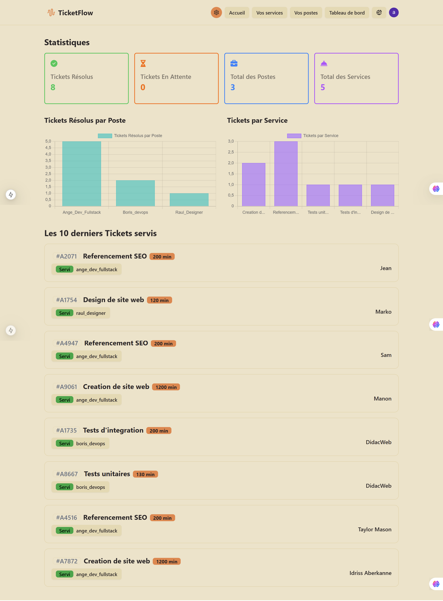
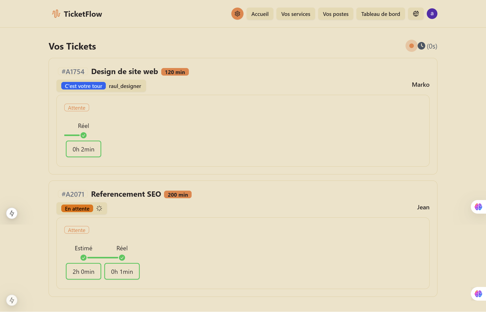

# Projet de Gestion de Tickets

## Description

Ce projet est une application de gestion de tickets développée en utilisant Next.js et Prisma. L'application permet aux utilisateurs de créer, suivre et gérer des tickets pour divers services offerts par une entreprise.

## Fonctionnalités

- **Création de Tickets** : Les utilisateurs peuvent créer des tickets pour différents services en fournissant leur nom et en sélectionnant le service souhaité.
- **Suivi des Tickets** : Les utilisateurs peuvent suivre l'état de leurs tickets en temps réel.
- **Gestion des Services** : Les entreprises peuvent ajouter, modifier et supprimer des services.
- **Statistiques des Tickets** : Les utilisateurs peuvent voir des statistiques sur les tickets, y compris le temps d'attente estimé.

## Technologies Utilisées

- **Next.js** : Framework React pour le rendu côté serveur et la génération de sites statiques.
- **Prisma** : ORM pour interagir avec la base de données.
- **React** : Bibliothèque JavaScript pour construire des interfaces utilisateur.
- **FontAwesome** : Bibliothèque d'icônes pour améliorer l'interface utilisateur.

## Installation

1. Clonez le projet sur votre machine locale :

   ```bash
   git clone https://github.com/boris913/app-gestion-ticket
   ```

2. Accédez au répertoire du projet :

   ```bash
   cd app-gestion-ticket
   ```

3. Installez les dépendances :

   ```bash
   npm install
   ```

4. Configurez la base de données Prisma :

   ```bash
   npx prisma migrate dev
   ```

5. Démarrez le serveur de développement :

   ```bash
   npm run dev
   ```

## Utilisation

1. Ouvrez votre navigateur et accédez à `http://localhost:3000`.
2. Créez un compte ou connectez-vous pour accéder aux fonctionnalités de gestion des tickets.
3. Sélectionnez un service et créez un ticket en fournissant votre nom.
4. Suivez l'état de vos tickets en temps réel.

## Structure du Projet

- `pages/` : Contient les pages Next.js.
- `components/` : Contient les composants React réutilisables.
- `styles/` : Contient les fichiers CSS pour la mise en forme de l'application.
- `lib/` : Contient les fichiers de configuration et les utilitaires.
- `prisma/` : Contient les schémas Prisma et les migrations de base de données.

## Problèmes Connus

- **Problèmes de connexion aux polices Google Fonts** : En cas de problèmes de connexion, envisagez d'utiliser des polices locales.

## Captures d'écran

### Dashboard



### Suivi des Tickets


## Contribution

Les contributions sont les bienvenues ! Si vous souhaitez contribuer à ce projet, veuillez suivre les étapes suivantes :

1. Forkez le dépôt.
2. Créez une branche pour votre fonctionnalité (`git checkout -b feature/ma-fonctionnalité`).
3. Commitez vos modifications (`git commit -am 'Ajout de ma fonctionnalité'`).
4. Poussez la branche (`git push origin feature/ma-fonctionnalité`).
5. Ouvrez une Pull Request.

## Licence

Ce projet est sous licence MIT. Voir le fichier [LICENSE](LICENSE) pour plus d'informations.

## Auteur

- **BaudouinDev** - [GitHub](https://github.com/boris913/)
